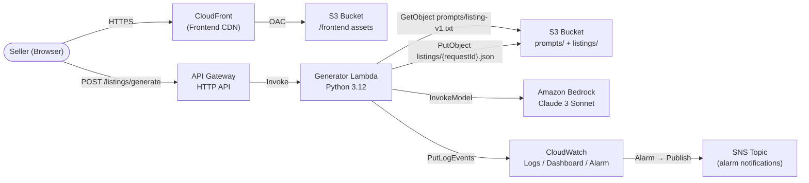

# Design Document — RojAI MVP

## Overview

RojAI is a serverless AI commerce assistant that turns raw seller input into polished,
marketplace-ready product listings. A Seller fills in a web form (FrontendApp), the request
travels through an Amazon API Gateway HTTP API to an AWS Lambda function (Generator), which
loads a versioned PromptTemplate from S3, builds a prompt, calls Amazon Bedrock (Claude 3
Sonnet), validates the response, persists an artifact back to S3, and returns the structured
listing to the browser.

The entire stack is defined in a single AWS CDK TypeScript project and can be deployed with
one `cdk deploy` command. There is no persistent compute, no user authentication, and no
marketplace integration in the MVP.

**Key design goals:**
- Every component uses an AWS-managed service; zero self-hosted infrastructure.
- The prompt can be updated without redeploying Lambda code (S3-resident template, no
  in-process caching).
- The frontend can run against a local mock so developers never need live AWS credentials
  for UI work.
- All observability flows through CloudWatch (structured JSON logs, dashboard, alarm).

---

## Architecture

### Component Diagram



### Request Lifecycle (happy path)

1. Seller submits form → `POST /listings/generate` (JSON body, HTTPS).
2. API Gateway validates the route and forwards the event to Lambda.
3. Lambda generates a UUID v4 `requestId`, validates the request body fields.
4. Lambda calls `s3.get_object(Key="prompts/listing-v1.txt")` → reads template.
5. Lambda replaces `{{productName}}`, `{{keyFeatures}}`, `{{category}}` tokens.
6. Lambda calls `bedrock.invoke_model(modelId=CLAUDE_MODEL_ID, body=...)`.
7. Lambda parses the JSON response; retries up to two times on malformed output.
8. Lambda writes `{ListingRequest, ListingResponse}` to `listings/{requestId}.json`; on
   failure, logs the error and continues (non-fatal).
9. Lambda emits a structured JSON log entry (`requestId`, `category`, `durationMs`,
   `status`).
10. Lambda returns HTTP 200 with the ListingResponse body.

### Failure paths

| Condition | Lambda returns | HTTP status |
|---|---|---|
| Missing / invalid request field | 400 JSON `{error, requestId}` | 400 |
| S3 GetObject fails (template missing) | 503 JSON `{error, requestId}` | 503 |
| Template tokens missing | 503 JSON `{error, requestId}` | 503 |
| Bedrock malformed × 3 attempts | 502 JSON `{error, requestId}` | 502 |
| S3 PutObject fails (artifact) | Log only, return 200 | 200 |

---

## Components and Interfaces

### Frontend: `frontend/`

The FrontendApp is a React + TypeScript single-page application built with Vite. It is
deployed to S3 and served via CloudFront.

**Component tree:**
```
App (App.tsx)
├── ListingForm (components/ListingForm.tsx)
└── ListingResult (components/ListingResult.tsx)
```

**API abstraction layer:**
- `src/api/client.ts` — production client that calls the real API Gateway URL (injected
  via `VITE_API_URL` environment variable at build time).
- `src/mocks/mockClient.ts` — local mock that returns a hardcoded successful
  `ListingResponse` after a simulated 1.5 s delay, enabling full UI development without
  any AWS connection.
- `App.tsx` selects the client at startup: if `import.meta.env.VITE_MOCK_MODE === "true"`,
  the mock client is used; otherwise the real client is used.

**`ListingForm` props and behaviour:**
```typescript
interface ListingFormProps {
  onSubmit: (req: ListingRequest) => void;
  isLoading: boolean;
}
```
- Renders four fields: `productName` (text input), `keyFeatures` (textarea),
  `category` (select with a fixed list of marketplace categories), `imageUrl`
  (text input, optional).
- On submit, validates all required fields client-side. For each empty required field, sets
  an inline validation error adjacent to the field label. Does NOT dispatch API call if
  validation fails.
- Disables the submit button and shows a spinner while `isLoading === true`.
- If no response is received within 20 s after dispatch, hides spinner, shows timeout
  message, re-enables button, and preserves all form data.

**`ListingResult` props and behaviour:**
```typescript
interface ListingResultProps {
  response: ListingResponse | null;
  error: string | null;
}
```
- When `response` is non-null: renders three labelled `<textarea readOnly>` elements for
  `title`, `bulletPoints` (newline-joined), and `description`.
- When `error` is non-null: renders a styled error banner with the human-readable message
  (no raw HTTP codes, no stack traces).

**`ListingRequest` and `ListingResponse` TypeScript types** (shared between client and mock):
```typescript
// src/types.ts
export interface ListingRequest {
  productName: string;   // required, max 200 chars
  keyFeatures: string;   // required, max 2000 chars
  category: string;      // required, max 100 chars
  imageUrl?: string;     // optional, max 2048 chars, HTTPS URL
}

export interface ListingResponse {
  title: string;         // max 200 chars
  bulletPoints: string[]; // 1–5 items, each max 500 chars
  description: string;   // max 2000 chars
  requestId: string;     // UUID v4
}
```

**Client interface** (both `client.ts` and `mockClient.ts` implement the same signature):
```typescript
// src/api/types.ts
export type GenerateListing = (req: ListingRequest) => Promise<ListingResponse>;
```

`client.ts` implementation:
```typescript
export const generateListing: GenerateListing = async (req) => {
  const res = await fetch(`${import.meta.env.VITE_API_URL}/listings/generate`, {
    method: "POST",
    headers: { "Content-Type": "application/json" },
    body: JSON.stringify(req),
  });
  if (!res.ok) {
    const body = await res.json().catch(() => ({}));
    throw new Error(body.error ?? "Something went wrong. Please try again.");
  }
  return res.json();
};
```

**`vite.config.ts`** key settings:
```typescript
export default defineConfig({
  plugins: [react()],
  build: { outDir: "dist" },
  // VITE_API_URL and VITE_MOCK_MODE injected via .env or CDK deploy output
});
```

**Environment variables:**

| Variable | Description | Required |
|---|---|---|
| `VITE_API_URL` | API Gateway invoke URL (e.g. `https://abc123.execute-api.us-east-1.amazonaws.com`) | Yes (prod) |
| `VITE_MOCK_MODE` | Set to `"true"` to use mock client locally | No (default false) |

---

### Backend: `backend/`

**`src/handler.py`** — single Lambda handler module.

**Entry point:**
```python
def handler(event: dict, context) -> dict:
```
API Gateway HTTP API v2 passes the request as a JSON event; the function returns a dict
that API Gateway converts to an HTTP response.

**Handler flow (pseudocode):**
```
1. request_id = str(uuid.uuid4())
2. try:
3.   body = json.loads(event["body"])
4. except:
5.   return 400 {"error": "Invalid JSON body", "requestId": request_id}
6.
7. errors = validate_request(body)    # see Validation section
8. if errors:
9.   return 400 {"error": errors, "requestId": request_id}
10.
11. start_time = time.monotonic()
12.
13. try:
14.   template = get_prompt_template()  # S3 GetObject
15. except S3Error:
16.   return 503 {"error": "Prompt template unavailable.", "requestId": request_id}
17.
18. if not all_tokens_present(template):
19.   return 503 {"error": "Prompt template is misconfigured.", "requestId": request_id}
20.
21. prompt = render_prompt(template, body)
22.
23. listing = None
24. for attempt in range(3):
25.   raw = invoke_bedrock(prompt)
26.   listing = parse_bedrock_response(raw)
27.   if listing is not None:
28.     break
29.
30. if listing is None:
31.   log_structured(request_id, body["category"], ..., status="error")
32.   return 502 {"error": "AI service returned an invalid response.", "requestId": request_id}
33.
34. listing["requestId"] = request_id
35.
36. try:
37.   save_artifact(request_id, body, listing)  # S3 PutObject
38. except Exception as e:
39.   log_s3_write_failure(request_id, str(e))   # non-fatal
40.
41. duration_ms = int((time.monotonic() - start_time) * 1000)
42. log_structured(request_id, body["category"], duration_ms, status="success")
43.
44. return 200 listing
```

**Validation (`validate_request`):**

| Field | Rule |
|---|---|
| `productName` | Required, string, 1–200 characters |
| `keyFeatures` | Required, string, 1–2000 characters |
| `category` | Required, string, 1–100 characters |
| `imageUrl` | Optional; when present: string, max 2048 chars, must match `^https://` |

Returns a dict `{fieldName: errorMessage}` for every violated rule. Returns `{}` if valid.

**Prompt rendering (`render_prompt`):**
```python
def render_prompt(template: str, body: dict) -> str:
    return (template
        .replace("{{productName}}", body["productName"])
        .replace("{{keyFeatures}}", body["keyFeatures"])
        .replace("{{category}}", body["category"]))
```

**Bedrock invocation (`invoke_bedrock`):**
- Model ID: `anthropic.claude-3-sonnet-20240229-v1:0` (configurable via `BEDROCK_MODEL_ID`
  environment variable on Lambda).
- API: `boto3` client `bedrock-runtime`, method `invoke_model`.
- Request body (Claude Messages API format):
```python
{
    "anthropic_version": "bedrock-2023-05-31",
    "max_tokens": 1024,
    "messages": [{"role": "user", "content": prompt}]
}
```
- Extracts response text from `response["content"][0]["text"]`.

**Response validation (`parse_bedrock_response`):**
1. Attempt `json.loads()` of the text — return `None` on failure.
2. Check `isinstance(data.get("title"), str)` — return `None` if false.
3. Check `isinstance(data.get("bulletPoints"), list) and len(data["bulletPoints"]) >= 1` —
   return `None` if false.
4. Check `isinstance(data.get("description"), str)` — return `None` if false.
5. Return the parsed dict.

**S3 key patterns:**
- Template: `prompts/listing-v1.txt` (read-only from Lambda perspective)
- Artifact: `listings/{request_id}.json`

**Environment variables on Lambda:**

| Variable | Description |
|---|---|
| `BUCKET_NAME` | S3 bucket name (injected by CDK) |
| `BEDROCK_MODEL_ID` | Bedrock model ID (default `anthropic.claude-3-sonnet-20240229-v1:0`) |

**Structured log format (CloudWatch):**
```json
{
  "requestId": "<uuid>",
  "category": "<category>",
  "durationMs": 3420,
  "status": "success"
}
```
Only these four keys are emitted. No seller-supplied content is ever logged.

**`tests/test_handler.py`** — unit tests using `pytest` and `moto` for S3 mocking plus
`unittest.mock` for Bedrock calls.

**`requirements.txt`:**
```
boto3>=1.34.0
pytest>=8.0.0
moto[s3]>=5.0.0
```

---

### Infrastructure: `infra/`

**`bin/app.ts`** — CDK app entry point:
```typescript
import * as cdk from "aws-cdk-lib";
import { RojAIStack } from "../lib/rojAI-stack";

const app = new cdk.App();
new RojAIStack(app, "RojAIStack", {
  env: { account: process.env.CDK_DEFAULT_ACCOUNT, region: process.env.CDK_DEFAULT_REGION },
});
```

**`lib/rojAI-stack.ts`** — single CDK stack; constructs created in order:

1. **S3 Bucket** (`aws-cdk-lib/aws-s3`)
   - `blockPublicAccess: BlockPublicAccess.BLOCK_ALL`
   - `removalPolicy: RemovalPolicy.RETAIN`
   - `versioned: false`
   - Bucket name auto-generated by CDK (avoid global naming conflicts).

2. **CloudFront OAC + Distribution** (`aws-cdk-lib/aws-cloudfront`)
   - OAC type `S3` with signing behaviour `ALWAYS`.
   - Distribution origin: S3 bucket, OAC attached.
   - Default behaviour: viewer protocol policy `REDIRECT_TO_HTTPS`, cache policy
     `CachePolicy.CACHING_OPTIMIZED`.
   - Default root object: `index.html`.
   - Error response: 404 → `index.html` / 200 (SPA fallback).

3. **Lambda Function** (`aws-cdk-lib/aws-lambda`)
   - Runtime: `Runtime.PYTHON_3_12`
   - Handler: `handler.handler`
   - Code: `Code.fromAsset("../backend/src")`
   - Timeout: `Duration.seconds(30)`
   - Memory: `512` MB
   - Environment: `BUCKET_NAME` = bucket name, `BEDROCK_MODEL_ID` = model ID constant.
   - Log group: `aws-cdk-lib/aws-logs` `LogGroup` with retention 30 days.

4. **IAM grants** (via CDK helper methods):
   - `bucket.grantRead(fn, "prompts/*")`
   - `bucket.grantPut(fn, "listings/*")`
   - `fn.addToRolePolicy(bedrockPolicy)` — `bedrock:InvokeModel` on model ARN.

5. **API Gateway HTTP API** (`aws-cdk-lib/aws-apigatewayv2`)
   - `HttpApi` with `corsPreflight`:
     ```typescript
     {
       allowOrigins: ["https://<cfDomain>", "http://localhost:3000", "http://localhost:5173"],
       allowMethods: [CorsHttpMethod.POST, CorsHttpMethod.OPTIONS],
       allowHeaders: ["Content-Type"],
     }
     ```
   - Route: `POST /listings/generate` → `HttpLambdaIntegration` pointing to Generator.
   - CloudWatch access logging: `CfnStage` with `accessLogSettings` pointing to a
     dedicated `LogGroup`.
   - `$default` stage with auto-deploy enabled.

6. **CloudWatch Dashboard** (`aws-cdk-lib/aws-cloudwatch`)
   - Name: `RojAI-MVP`
   - Widgets: Lambda invocation count, Lambda error count, Lambda P99 duration, API Gateway
     4xx error rate, API Gateway 5xx error rate.

7. **CloudWatch Alarm**
   - Metric: Lambda `Errors` sum over 5 minutes.
   - Threshold: > 5, evaluation periods: 1.
   - `AlarmActions`: SNS topic (created in the same stack, email subscription injected via
     CDK context key `alarmEmail`).

8. **CfnOutput** values (available after `cdk deploy`):
   - `ApiUrl` — API Gateway invoke URL.
   - `CloudFrontUrl` — CloudFront distribution domain.
   - `BucketName` — S3 bucket name.

**`cdk.json`:**
```json
{
  "app": "npx ts-node --prefer-ts-exts bin/app.ts",
  "context": {
    "@aws-cdk/aws-s3:serverAccessLogsUseBucketPolicy": true
  }
}
```

**`package.json`** (infra):
```json
{
  "scripts": {
    "build": "tsc",
    "cdk": "cdk"
  },
  "dependencies": {
    "aws-cdk-lib": "2.140.0",
    "constructs": "10.3.0"
  },
  "devDependencies": {
    "aws-cdk": "2.140.0",
    "ts-node": "10.9.2",
    "typescript": "5.4.5"
  }
}
```

---

### Prompt Template: `prompts/listing-v1.txt`

```
You are a professional product listing copywriter for online marketplaces.

Given the product information below, generate a marketplace-ready product listing as a JSON object with exactly these keys: "title", "bulletPoints", "description".

Rules:
- title: A compelling product title, max 200 characters.
- bulletPoints: An array of 3 to 5 bullet points, each max 500 characters, highlighting key features and benefits.
- description: A detailed product description, max 2000 characters, written in an engaging tone for online shoppers.

Return ONLY the JSON object. Do not include any explanation, markdown, or code fences.

Product Name: {{productName}}
Key Features: {{keyFeatures}}
Category: {{category}}
```

This file is deployed manually to `s3://<BUCKET_NAME>/prompts/listing-v1.txt` as part of
the Day 1 milestone (or via an S3 BucketDeployment CDK construct as an optional enhancement).

---

## Data Models

### ListingRequest

| Field | Type | Required | Constraints |
|---|---|---|---|
| `productName` | string | Yes | 1–200 characters |
| `keyFeatures` | string | Yes | 1–2000 characters |
| `category` | string | Yes | 1–100 characters |
| `imageUrl` | string | No | Max 2048 characters; must start with `https://` when present |

Example:
```json
{
  "productName": "Ultra-Grip Silicone Baking Mat",
  "keyFeatures": "Non-stick surface, heat resistant to 480°F, dishwasher safe, includes measurement markings",
  "category": "Kitchen & Dining",
  "imageUrl": "https://example.com/images/baking-mat.jpg"
}
```

### ListingResponse

| Field | Type | Constraints |
|---|---|---|
| `title` | string | Max 200 characters |
| `bulletPoints` | string[] | 1–5 items; each item max 500 characters |
| `description` | string | Max 2000 characters |
| `requestId` | string | UUID v4 |

Example:
```json
{
  "title": "Ultra-Grip Silicone Baking Mat — Non-Stick, Heat-Resistant to 480°F",
  "bulletPoints": [
    "Premium non-stick silicone surface — baked goods release effortlessly every time",
    "Heat-resistant up to 480°F — safe for all standard home ovens",
    "Dishwasher-safe for quick, hassle-free cleanup after baking",
    "Built-in measurement markings for precise dough rolling and portion sizing"
  ],
  "description": "Elevate your baking with the Ultra-Grip Silicone Baking Mat...",
  "requestId": "550e8400-e29b-41d4-a716-446655440000"
}
```

### S3 Artifact (`listings/{requestId}.json`)

```json
{
  "request": { ...ListingRequest },
  "response": { ...ListingResponse }
}
```

### CloudWatch Structured Log Entry

```json
{
  "requestId": "550e8400-e29b-41d4-a716-446655440000",
  "category": "Kitchen & Dining",
  "durationMs": 3420,
  "status": "success"
}
```

### Error Response

```json
{
  "error": "productName is required.",
  "requestId": "550e8400-e29b-41d4-a716-446655440000"
}
```

For 400 validation errors with multiple offending fields:
```json
{
  "error": { "productName": "productName is required.", "category": "category is required." },
  "requestId": "550e8400-e29b-41d4-a716-446655440000"
}
```

---

## Correctness Properties

*A property is a characteristic or behavior that should hold true across all valid executions of a system — essentially, a formal statement about what the system should do. Properties serve as the bridge between human-readable specifications and machine-verifiable correctness guarantees.*

The following properties are derived from the acceptance criteria and are suitable for property-based testing because they involve pure functions (validation, prompt rendering, response parsing, log formatting) whose correctness must hold across a wide input domain, not just for specific examples.

**Property reflection:** Before writing the properties, redundant candidates were eliminated:
- 4.3 (field validation) and 10.1 (400 response with field names) are merged into a single comprehensive validation property (Property 1) since both describe the same `validate_request` logic.
- 4.4 (ListingResponse structure) and 9.4 (parse_bedrock_response) are the same function under two framings; they are consolidated into Property 3.
- 6.1 (log contains four keys) and 6.2 (log does not contain seller content) are complementary but non-redundant; both are kept as independent properties.
- 3.5 (render all fields in ListingResult) and 10.4 (error display is human-readable) address different component states and are kept separate.

---

### Property 1: Request Validation Rejects All Invalid Inputs with Field-Specific Errors

*For any* `ListingRequest`-shaped object where one or more fields violate the constraints defined in Requirement 4.3 (missing required field, empty string for required field, `productName` > 200 chars, `keyFeatures` > 2000 chars, `category` > 100 chars, `imageUrl` > 2048 chars or not starting with `https://`), `validate_request` SHALL return a non-empty dict containing an entry for each and only each offending field, keyed by its exact field name. For any request where all fields conform to their constraints, `validate_request` SHALL return an empty dict.

**Validates: Requirements 4.3, 10.1**

---

### Property 2: Prompt Rendering Substitutes All Tokens and Preserves Values

*For any* non-empty strings `productName`, `keyFeatures`, and `category`, calling `render_prompt(template, body)` on a template containing all three tokens (`{{productName}}`, `{{keyFeatures}}`, `{{category}}`) SHALL produce a string that (a) contains no remaining `{{...}}` tokens, and (b) contains the exact values of `productName`, `keyFeatures`, and `category` as substrings.

**Validates: Requirements 4.6, 9.2**

---

### Property 3: Bedrock Response Parsing Accepts Valid Structures and Rejects Invalid Ones

*For any* JSON string that is a valid JSON object containing a `title` (non-empty string), `bulletPoints` (non-empty array of strings), and `description` (non-empty string), `parse_bedrock_response` SHALL return a non-None dict with those three keys. *For any* JSON string missing any of those keys, having a `title` that is not a string, having `bulletPoints` that is not a non-empty array, or having a `description` that is not a string, `parse_bedrock_response` SHALL return `None`.

**Validates: Requirements 9.4, 4.4**

---

### Property 4: Retry Exhaustion Always Returns 502 and Makes Exactly Three Bedrock Calls

*For any* handler invocation where all three Bedrock calls return malformed responses (as defined by Property 3's rejection criteria), the Lambda handler SHALL make exactly three `bedrock:InvokeModel` calls and SHALL return an HTTP 502 response body containing an `error` field and a valid `requestId` field.

**Validates: Requirements 4.8, 10.3**

---

### Property 5: Structured Log Contains Exactly the Four Required Fields and No Seller Content

*For any* combination of `requestId` (UUID string), `category` (arbitrary string), `durationMs` (non-negative integer), and `status` (`"success"` or `"error"`), and for any `ListingRequest` with arbitrary `productName`, `keyFeatures`, `imageUrl`, and `category` values, the JSON string emitted by `log_structured` SHALL:
- Contain exactly the keys `requestId`, `category`, `durationMs`, and `status`.
- NOT contain the `productName`, `keyFeatures`, or `imageUrl` values from the ListingRequest as substrings anywhere in the serialised JSON.

**Validates: Requirements 6.1, 6.2**

---

### Property 6: Template Token Validation Rejects Any Template Missing One or More Tokens

*For any* string that does not contain all three of `{{productName}}`, `{{keyFeatures}}`, and `{{category}}` as substrings, `all_tokens_present` SHALL return `False` and the handler SHALL return 503 without invoking Bedrock. *For any* string that contains all three tokens, `all_tokens_present` SHALL return `True`.

**Validates: Requirements 9.2**

---

### Property 7: Frontend Error Display Never Exposes Raw HTTP Codes, Exception Names, or Stack Traces

*For any* API error response (4xx or 5xx) with an arbitrary JSON body, the string rendered in the `ListingResult` error banner SHALL NOT contain: any three-digit HTTP status code (`\d{3}`), any Python or JavaScript exception class name pattern (e.g. `Error:`, `Exception`, `Traceback`), or any stack-frame-like pattern. The submit button SHALL be in an enabled state after the error is displayed.

**Validates: Requirements 10.4**

---

### Property 8: Valid ListingResponse Renders All Three Components in Separate Labelled Fields

*For any* valid `ListingResponse` object (title string, bulletPoints array of 1–5 strings, description string, requestId UUID), rendering `ListingResult` with that response SHALL produce output containing: a labelled element for the title containing the exact `title` value, a labelled element for bullet points containing each bullet point value, and a labelled element for the description containing the exact `description` value.

**Validates: Requirements 3.5, 1.3**

---

### Property 9: requestId Is Present in All Error Responses and Matches UUID v4 Format

*For any* error condition (400, 502, 503) triggered by the Lambda handler, the JSON response body SHALL contain a `requestId` field whose value matches the UUID v4 format (`^[0-9a-f]{8}-[0-9a-f]{4}-4[0-9a-f]{3}-[89ab][0-9a-f]{3}-[0-9a-f]{12}$`).

**Validates: Requirements 10.5**

---

## Error Handling

### Lambda Error Taxonomy

| Error Class | Trigger | HTTP Status | Response Body |
|---|---|---|---|
| Validation Error | Missing or invalid request field | 400 | `{error: {fieldName: msg, ...}, requestId}` |
| Template Unavailable | S3 GetObject fails or returns non-2xx | 503 | `{error: "Prompt template unavailable.", requestId}` |
| Template Invalid | Missing one or more `{{token}}` | 503 | `{error: "Prompt template is misconfigured.", requestId}` |
| Bedrock Failure | All 3 attempts return malformed JSON | 502 | `{error: "AI service returned an invalid response.", requestId}` |
| S3 Write Failure | PutObject for artifact fails | **non-fatal** | Log only; 200 still returned |

### Frontend Error Handling

- All HTTP error responses are caught in `client.ts` and converted to a plain `Error`
  object with a human-readable message extracted from `body.error` if available.
- The generic fallback message is: `"Something went wrong. Please try again."`.
- A 20-second `AbortController` timeout wraps every fetch call. On abort, the frontend
  displays: `"The request timed out. Please try again."`.
- Error messages displayed in `ListingResult` are always plain English text. No status
  codes, no exception names, no stack traces.
- After any error, the submit button is re-enabled and all form field values are preserved
  in React state.

### Retry Logic (Backend)

```
attempt 1: invoke_bedrock(prompt) → parse → if None, continue
attempt 2: invoke_bedrock(prompt) → parse → if None, continue
attempt 3: invoke_bedrock(prompt) → parse → if None, return 502
```

- No back-off delay between retries (Lambda timeout is 30 s; retries are synchronous).
- Each attempt is a fresh `invoke_model` call with the identical prompt.
- If any attempt succeeds, processing continues immediately without further retries.

### S3 Template Retrieval Failure

- Wrapped in a try/except for `botocore.exceptions.ClientError`.
- On any exception, return 503 immediately without calling Bedrock.
- The `requestId` is generated before the S3 call, so it is always available in the 503
  response body.

---

## Testing Strategy

### Unit Tests (Backend — `backend/tests/test_handler.py`)

Tested with `pytest`, `moto` (S3 mock), and `unittest.mock` (Bedrock mock).

**Example-based unit tests:**
- Valid request end-to-end (mock S3 template, mock Bedrock valid JSON) → 200.
- S3 GetObject failure → 503, Bedrock never called.
- Template missing `{{productName}}` token → 503, Bedrock never called.
- All three Bedrock attempts malformed → 502, exactly 3 mock calls.
- S3 PutObject failure → 200 still returned, error logged.
- Missing `productName` field → 400 with `{"productName": "..."}` in error.
- `imageUrl` without `https://` prefix → 400 with `{"imageUrl": "..."}` in error.

**Property-based tests** (using [Hypothesis](https://hypothesis.readthedocs.io/) for Python):
- **Property 1**: `@given` random ListingRequest dicts with random field values →
  validate `validate_request` returns errors for all and only violated constraints.
  Minimum 100 iterations.
- **Property 2**: `@given` random `productName`, `keyFeatures`, `category` strings →
  validate `render_prompt` substitutes all tokens. Minimum 100 iterations.
- **Property 3**: `@given` random JSON-serialisable dicts with varying key/type presence →
  validate `parse_bedrock_response` returns None iff structure is invalid. Minimum 100 iterations.
- **Property 4**: `@given` random valid ListingRequests with all-malformed Bedrock mock →
  validate handler makes exactly 3 Bedrock calls and returns 502. Minimum 100 iterations.
- **Property 5**: `@given` random requestId/category/durationMs/status + random ListingRequest →
  validate `log_structured` output JSON. Minimum 100 iterations.
- **Property 6**: `@given` random template strings → validate `all_tokens_present`. Minimum 100 iterations.
- **Property 9**: `@given` random error-triggering inputs → validate requestId format in all error responses. Minimum 100 iterations.

Tag format for each property test:
```python
# Feature: rojAI-mvp, Property 1: Request Validation Rejects All Invalid Inputs with Field-Specific Errors
```

### Unit Tests (Frontend — `frontend/src/`)

Tested with Vitest + React Testing Library.

**Example-based tests:**
- `ListingForm` renders all four fields and category dropdown.
- `ListingForm` submit with all fields populated calls `onSubmit` once.
- `ListingForm` submit with empty `productName` shows inline error, does not call `onSubmit`.
- `mockClient.ts` returns a valid `ListingResponse` shaped object after delay.

**Property-based tests** (using [fast-check](https://fast-check.dev/) for TypeScript):
- **Property 7**: `fc.record({...})` generating random error messages → verify `ListingResult`
  banner text matches none of `\d{3}`, `Error:`, `Exception`, `Traceback`. Minimum 100 iterations.
- **Property 8**: `fc.record({...})` generating random valid `ListingResponse` objects →
  verify `ListingResult` renders all three fields with correct content. Minimum 100 iterations.

Tag format:
```typescript
// Feature: rojAI-mvp, Property 8: Valid ListingResponse Renders All Three Components in Separate Labelled Fields
```

### Infrastructure Tests (`infra/`)

Tested with AWS CDK's built-in `assertions` module (`aws-cdk-lib/assertions`).

**Snapshot / assertion tests:**
- Stack synthesises without errors (`cdk synth`).
- Lambda function has timeout 30 s, memory 512 MB, runtime Python 3.12.
- S3 bucket has `BlockPublicAccess.BLOCK_ALL` and removal policy `RETAIN`.
- API Gateway has CORS configured with `localhost:5173` origin.
- CloudWatch Dashboard named `RojAI-MVP` exists.
- CloudWatch Alarm threshold is 5 errors over 5 minutes.

### Integration / Smoke Tests

- Day 1 smoke: `curl -X POST <API_URL>/listings/generate -d '<valid payload>'` returns 200
  with non-empty `title`, `bulletPoints`, `description`.
- Day 2 smoke: Load CloudFront URL in browser, submit form, verify all three output fields
  are displayed.

### Test Configuration Summary

| Layer | Framework | PBT Library | Min PBT Iterations |
|---|---|---|---|
| Backend (Python) | pytest | Hypothesis | 100 |
| Frontend (TypeScript) | Vitest + RTL | fast-check | 100 |
| Infrastructure (TypeScript) | Jest (via CDK) | N/A | N/A |
